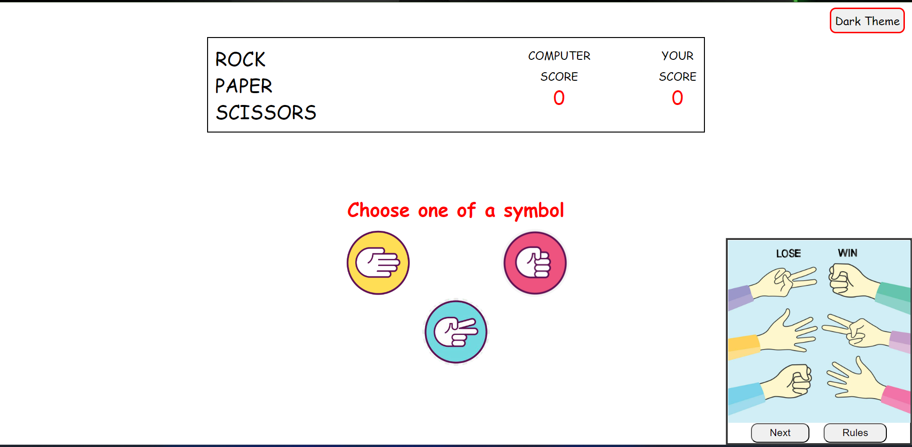
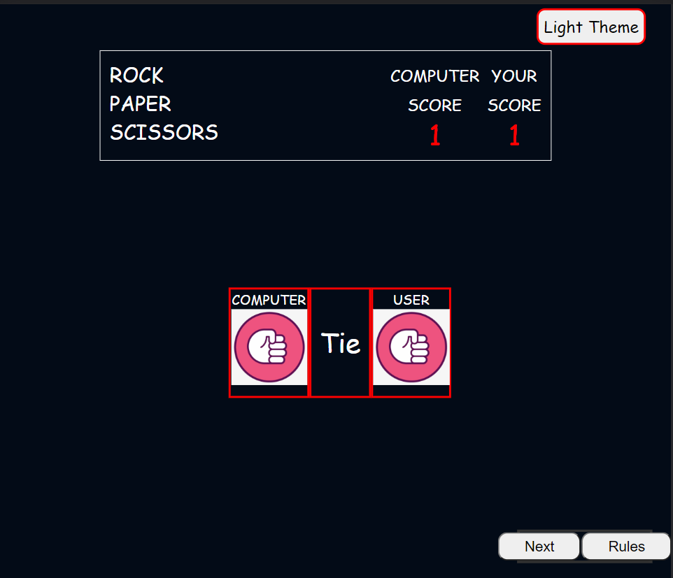
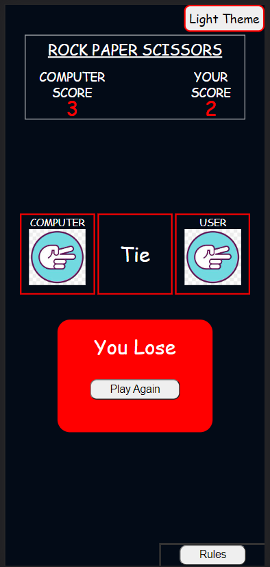

# Rock ✊ Paper 🤚 Scissors ✌

#### <a href="https://extraordinary-pegasus-9ae588.netlify.app/">Click to play</a>

`About Game`
 
Rock paper scissors is a hand game, usually played between two people, in which each player simultaneously forms one of three shapes with an outstretched hand. These shapes are "rock", "paper", and "scissors".
#### Desktop Screen

#### Tablet Screen

#### Mobile Screen
